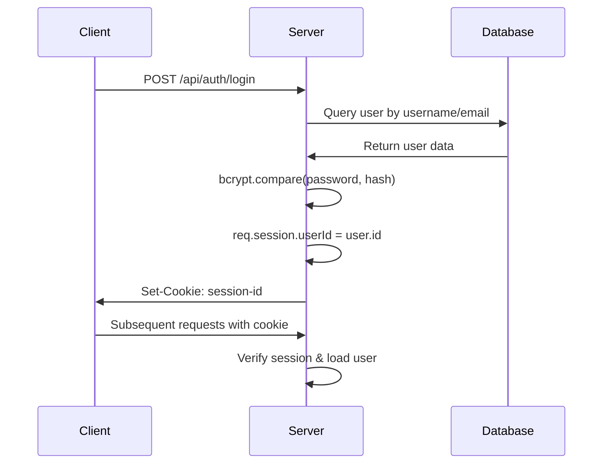

# Career Portal - Architecture Documentation

## System Overview
The Career Portal is a modern full-stack web application built with React, TypeScript, and Node.js. It features role-based authentication, job management, and application tracking with beautiful "The Resource Consultants" purple branding.

## Architecture Pattern
**Pattern**: Modern Full-Stack MVC with API-First Design
- **Frontend**: React SPA with client-side routing
- **Backend**: RESTful API with Express.js
- **Database**: PostgreSQL with type-safe ORM
- **Authentication**: Session-based with bcrypt security

## Technology Stack

### Frontend Stack
```typescript
React 18.3.1          // Component framework
TypeScript 5.6.3      // Type safety
Vite 5.4.14           // Build tool and dev server
Wouter 3.3.5          // Lightweight client-side routing
TanStack Query 5.60.5 // Server state management
React Hook Form 7.53.1 // Form handling
Zod 3.23.8            // Schema validation
Tailwind CSS 3.4.14  // Utility-first CSS framework
shadcn/ui             // Accessible component primitives
Lucide React 0.453.0 // Icon library
Framer Motion 11.13.1 // Animation library
```

### Backend Stack
```typescript
Node.js 20.18.1       // Runtime environment
Express.js 4.21.2     // Web framework
TypeScript 5.6.3      // Type safety
Drizzle ORM 0.39.1    // Type-safe database ORM
PostgreSQL 16+        // Primary database
bcrypt + @types/bcrypt // Password hashing
Express Session 1.18.1 // Session management
Multer 1.4.5          // File upload handling
Zod 3.23.8            // Schema validation
```

### Development Tools
```typescript
tsx 4.19.1            // TypeScript execution
Vite 5.4.14           // Development server
Drizzle Kit 0.30.4    // Database migrations
ESBuild 0.25.0        // JavaScript bundler
```

## Project Structure

```
career-portal/
├── client/                    # Frontend application
│   ├── src/
│   │   ├── components/        # Reusable UI components
│   │   │   ├── ui/           # shadcn/ui component primitives
│   │   │   └── layout/       # Layout components
│   │   ├── pages/            # Page components (routes)
│   │   ├── lib/              # Utilities and configurations
│   │   │   ├── queryClient.ts # TanStack Query setup
│   │   │   └── utils.ts      # Helper functions
│   │   ├── hooks/            # Custom React hooks
│   │   └── App.tsx           # Main application component
│   ├── index.html            # HTML entry point
│   └── vite.config.ts        # Vite configuration
├── server/                    # Backend application
│   ├── index.ts              # Express server setup
│   ├── routes.ts             # API routes and handlers
│   ├── storage.ts            # In-memory storage implementation
│   ├── postgres-storage.ts   # PostgreSQL storage implementation
│   └── vite.ts              # Vite integration for production
├── shared/                    # Shared code between frontend/backend
│   └── schema.ts             # Database schema and validation
├── uploads/                   # File upload directory (resumes)
├── package.json              # Dependencies and scripts
├── drizzle.config.ts         # Database configuration
├── tailwind.config.ts        # Tailwind CSS configuration
├── theme.json                # Application theme configuration
└── tsconfig.json             # TypeScript configuration
```

## Frontend Architecture

### Component Hierarchy
```
App.tsx
├── Navigation Components
│   ├── Navbar (role-based visibility)
│   └── Sidebar (admin/employee portals)
├── Page Components
│   ├── LandingPage (public job board)
│   ├── AdminPortal (user/job management)
│   ├── EmployeePortal (job creation/management)
│   └── AuthPages (login/register)
├── UI Components (shadcn/ui)
│   ├── Forms (with validation)
│   ├── Tables (with sorting/filtering)
│   ├── Modals/Dialogs
│   └── Cards/Badges
└── Layout Components
    ├── Header/Footer
    └── Container/Grid systems
```

### State Management Strategy
- **Server State**: TanStack Query for API data
- **Form State**: React Hook Form with Zod validation
- **UI State**: React useState/useContext for local state
- **Authentication State**: Session-based (server-side)
- **Route State**: Wouter for client-side routing

### API Integration Pattern
```typescript
// Centralized API client with TanStack Query
const { data, isLoading, error } = useQuery({
  queryKey: ['/api/jobs', filters],
  enabled: !!user
});

const mutation = useMutation({
  mutationFn: (data) => apiRequest('/api/jobs', { method: 'POST', data }),
  onSuccess: () => queryClient.invalidateQueries({ queryKey: ['/api/jobs'] })
});
```

## Backend Architecture

### API Design Pattern
- **RESTful API**: Standard HTTP methods and status codes
- **Middleware Stack**: Authentication → Validation → Business Logic
- **Error Handling**: Centralized error responses
- **Type Safety**: Zod schema validation on all inputs

### Route Structure
```typescript
// Authentication Routes
POST   /api/auth/login           # User login
POST   /api/auth/logout          # User logout  
GET    /api/auth/me              # Current user info

// User Management (Admin only)
GET    /api/users                # List all users
POST   /api/users                # Create new user
PATCH  /api/users/:id            # Update user
PUT    /api/admin/users/:id      # Admin user update (with password)

// Job Management
GET    /api/jobs                 # List jobs (with filters)
GET    /api/jobs/:id             # Get single job
POST   /api/jobs                 # Create job (employee/admin)
PATCH  /api/jobs/:id             # Update job

// Application Management
GET    /api/applications         # List applications
POST   /api/applications         # Submit application
PATCH  /api/applications/:id     # Update application status

// Category Management
GET    /api/categories           # List categories
POST   /api/categories           # Create category (admin)
PATCH  /api/categories/:id       # Update category
```

### Security Architecture
```typescript
// Authentication Middleware
const requireAuth = (req, res, next) => {
  if (!req.session?.userId) return res.status(401).json(...);
  next();
};

// Role-based Authorization
const requireRole = (roles: string[]) => (req, res, next) => {
  if (!roles.includes(req.user.role)) return res.status(403).json(...);
  next();
};

// Password Security
const hashPassword = async (password: string) => {
  return bcrypt.hash(password, 10);  // Cost factor 10
};
```

## Database Architecture

### Storage Abstraction
```typescript
// Storage Interface (supports both in-memory and PostgreSQL)
interface IStorage {
  // User operations
  getUser(id: number): Promise<User | undefined>;
  getUserByUsername(username: string): Promise<User | undefined>;
  getUserByEmail(email: string): Promise<User | undefined>;
  createUser(user: InsertUser): Promise<User>;
  updateUser(id: number, updates: Partial<User>): Promise<User>;
  
  // Job operations
  getJobs(filters?: JobFilters): Promise<Job[]>;
  createJob(job: InsertJob): Promise<Job>;
  // ... more operations
}
```

### Schema Design Principles
- **Type Safety**: Drizzle ORM provides compile-time type checking
- **Validation**: Zod schemas ensure runtime validation
- **Relationships**: Foreign key constraints maintain data integrity
- **Performance**: Strategic indexes on frequently queried fields

## Authentication & Authorization

### Session Flow


### Role-Based Access Control
```typescript
Roles:
- applicant: Browse jobs, submit applications
- employee: Create/manage jobs, view applications
- admin: User management, all job/application access
- super_admin: Full system access including admin user management
```

## File Upload System

### Resume Upload Flow
```typescript
// Multer configuration for secure file uploads
const upload = multer({
  storage: diskStorage({
    destination: './uploads',
    filename: (req, file, cb) => {
      const uniqueSuffix = Date.now() + '-' + Math.round(Math.random() * 1e9);
      cb(null, file.fieldname + '-' + uniqueSuffix + path.extname(file.originalname));
    }
  }),
  fileFilter: (req, file, cb) => {
    const allowedMimes = ['application/pdf', 'application/msword', 'application/vnd.openxmlformats-officedocument.wordprocessingml.document'];
    cb(null, allowedMimes.includes(file.mimetype));
  },
  limits: { fileSize: 10 * 1024 * 1024 } // 10MB limit
});
```

## UI/UX Architecture

### Design System
- **Color Palette**: Purple theme (#9C27B0) for "The Resource Consultants"
- **Typography**: Inter font family for modern readability
- **Components**: shadcn/ui for accessibility and consistency
- **Responsive**: Mobile-first design with Tailwind CSS

### Theme Configuration
```typescript
// theme.json - Global theme settings
{
  "primary": "#9C27B0",        // Purple brand color
  "variant": "professional",   // Design variant
  "appearance": "light",       // Light theme
  "radius": 0.5               // Border radius (rem)
}
```

## Performance Considerations

### Frontend Optimization
- **Code Splitting**: Vite handles automatic chunk splitting
- **Query Caching**: TanStack Query caches API responses
- **Memoization**: React.memo for expensive components
- **Bundle Analysis**: Vite bundle analyzer for optimization

### Backend Optimization
- **Database Indexes**: Strategic indexing on query patterns
- **Connection Pooling**: PostgreSQL connection management
- **Session Storage**: In-memory sessions for development, Redis for production
- **File Serving**: Nginx for static file serving in production

## Deployment Architecture

### Development Environment
```
Vite Dev Server (5173) → Express API (5000) → PostgreSQL (5432)
```

### Production Environment
```
Nginx (80/443) → PM2 Process Manager → Node.js (5000) → PostgreSQL (5432)
```

### Scaling Considerations
- **Horizontal Scaling**: Multiple Node.js instances with load balancer
- **Database Scaling**: PostgreSQL read replicas for heavy read workloads
- **File Storage**: Move uploads to cloud storage (AWS S3, etc.)
- **Caching**: Redis for session storage and query caching

## Error Handling Strategy

### Frontend Error Boundaries
```typescript
// Global error boundary for React components
// TanStack Query error handling for API failures
// Form validation errors with user-friendly messages
```

### Backend Error Handling
```typescript
// Centralized error handler with structured logging
const handleZodError = (err: unknown, res: Response) => {
  if (err instanceof ZodError) {
    return res.status(400).json({
      message: "Validation error",
      errors: err.errors
    });
  }
  // Handle other error types...
};
```

## Testing Strategy
- **Unit Tests**: Component and utility function testing
- **Integration Tests**: API endpoint testing
- **E2E Tests**: Critical user journey testing
- **Type Safety**: TypeScript for compile-time error detection

---
**Architecture Version**: 2.0.0  
**Last Updated**: September 17, 2025  
**Status**: Production Ready